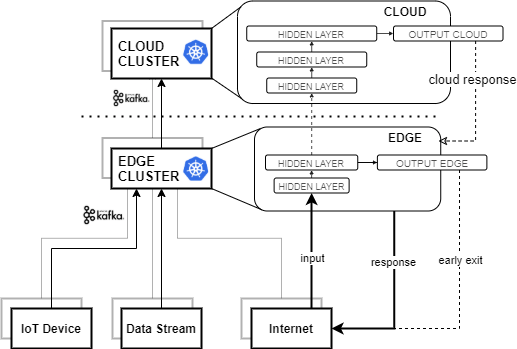

# A low-latency and fault-tolerant framework for Distributed and Deep Neural Networks over the Cloud-to-Things Continuum.

This work combines the advantages of the BranchyNet [[1]][[2]] approach with the edge-cloud architecture concept to support low-latency and fault-tolerant predictions. Thus, this code has been developed to facilitate the inference of BranchyNet-based models over different architecture levels, such as edge, fog and cloud by using Kafka, Python and Tensorflow. 



##### Table of Content

1. [Getting started](#getting-started)
2. [Docker Containerized Version](#docker-containerized-version)

    2.1. [Service deployment in Kubernetes](#service-deployment-in-kubernetes)

## Getting started

First, to run this code, we need to install dependencies included in the `requirements.txt`. We recommend the use of Python virtual environment for this.

```
(.venv)$ pip install -r requirements.txt
```

Once libraries are installed, we should be able to train a model as the one placed on `model.py`. We can modify the content of the function as we want, but we have to keep the first and the last value this function returns - of course, we can change their values. To train, we run:

```
(.venv)$ python code/model_training.py -i <PATH_TO_TRAINING_SET> [<TRAINING OPTIONS>]
```

After training, our model and submodels generated will be saved in the folder `saved_models` by default. If we want to modified the way we show the metrics during training, we can replace the function in `training_results.py`.

Finally, to perform inference with our model - where the input (*preprocessing*) and ouput can be modified in `input_preprocessing.py` and `output_results.py`, respectively -, we only need to call the `main.py` file:

```
python code/main.py -i <PATH_TO_TEST_SET> --labels <LABEL NAME FILE> --models saved_models/model --name  <NAME_DEVICE> --tensorflow
```

This will generate a CSV file according with our `output_results.py` function. However, it will contains a lot of blank spaces due to some of the values recorded in the CSV file is for our code when using edge, fog and cloud devices. In order to do that, we allow our code to send and receive from different Kafka servers specified in the arguments of the `main.py` program:

- `--producer-back`. IP to send values to the previous device - `localhost` by default.
- `--producer-back-port`. Port to send values to the previous device - default=`9092`.
- `--producer-back-topic`. Topic to send values to the previous device.
- `--producer-front`. IP to send values to the next device.
- `--producer-front-port`. Port to send values to the next device.
- `--producer-front-topic`. Topic to send values to the previous device.
    
- `--consumer-back`. IP to receive values from the previous device - `localhost` by default.
- `--consumer-back-port`. Port to send values to the previous device - default=`9092`.
- `--consumer-back-topic`. Topic to send values to the previous device.
- `--consumer-front`. IP to receive values from the next device.
- `--consumer-front-port`. Port to send values to the next device.
- `--consumer-front-topic`. Topic to send values to the previous device.

### Examples

> Using the flower dataset of tensorflow [[3]]

- If you want to try our code in your localhost but with different terminals:

    - Emulates a simple device that only capture and send values to the edge:
    ```
    python code/main.py -i data/flower_photos/train -l data/labels.txt --name device --producer-front localhost --producer-front-port 9092 --producer-front-topic from_device_to_edge --consumer-front localhost --consumer-front-port 9092 --consumer-front-topic from_edge_to_device
    ```

    - Emulates the edge service, receiving from the device and sending to the fog if prediction is not higher than the specified threshold (`0.8` by default), receiving from the fog and sending back the results to the device: 

    ```
    python code/main.py --models saved_models/edge --name local_edge --producer-back-topic from_edge_to_device --consumer-back-topic from_device_to_edge --producer-front localhost --producer-front-port 9092 --producer-front-topic from_edge_to_fog --consumer-front localhost --consumer-front-port 9092 --consumer-front-topic from_fog_to_edge --tensorflow
    ```

    - Emulates the fog service, receiving from the edge, making the inference,  sending to cloud if needed, and receiving from the cloud and sending back the results to the edge:
    ```
    python code/main.py --models saved_models/fog --name local_fog --producer-back-topic from_fog_to_edge --consumer-back-topic from_edge_to_fog --producer-front localhost --producer-front-port 9092 --producer-front-topic from_fog_to_cloud --consumer-front localhost --consumer-front-port 9092 --consumer-front-topic from_cloud_to_fog --tensorflow
    ```
    - Emulates the cloud service, receving from the fog, making the inference and sending the results back to the fog:
    ```
    python code/main.py --models saved_models/cloud --name local_cloud --producer-back-topic from_cloud_to_fog --consumer-back-topic from_fog_to_cloud --tensorflow
    ```

- Another example of use when we got a device and only an additional computer, either edge, fog or cloud:
    - Emulates the device:
    ```
    python code/main.py -i data/flower_photos/train -l data/labels.txt --name device --producer-front localhost --producer-front-port 9092 --producer-front-topic from_device_to_edge --consumer-front localhost --consumer-front-port 9092 --consumer-front-topic from_edge_to_device
    ```

    - Emulates the external computer with more resources, it receives from the device, computes the result and sends it back:
    ```
    python code/main.py --models saved_models/edge saved_models/fog saved_models/cloud --name local_edge --producer-back-topic from_edge_to_device --consumer-back-topic from_device_to_edge --tensorflow
    ```

## Docker Containerized Version

We provide three files, `Dockerfile-CLOUD`, `Dockerfile-EDGE`, and `Dockerfile-only-cloud`, as an example of how to use our code with Docker Containers. 

All of them use the models in `Distributed_vgg16-2` folder. The main model, which is the one used to train, is `FULL_MODEL`, and it contains the rest of submodels in this folder. The first dockerfile mentioned runs the main code with the `FOG` and `CLOUD` submodels, while the second one only use the `EDGE` submodel. The last of them, `Dockerfile-only-cloud`, use the three submodels as one like the `FULL_MODEL` does.

These container can be built as follows:

    docker build --pull --rm -f "Dockerfile-CLOUD" -t cloud:test "."

    docker build --pull --rm -f "Dockerfile-EDGE" -t edge:test "."

    docker build --pull --rm -f "Dockerfile-only-cloud" -t solo-cloud:test "."

### Service deployment in Kubernetes

Since this code can be containerized, it can be easily run as a service in Kubernetes. Therefore, we include several `yaml` files that can be used to deploy an edge-cloud architecture with 3 Kafka brokers. Along with these files, we include two additional ones that are used to run and delete these services in Kubernetes - `run.sh` and `delete.sh`, respectively.

    sh run.sh
    sh delete.sh

These files can be modified to fit different architecture configurations.

----

This a project of [ERTIS Lab](https://github.com/ertis-research) at [University of Malaga](uma.es)

[1]: https://arxiv.org/abs/1709.01686
[2]: https://github.com/kunglab/branchynet
[3]: https://www.tensorflow.org/tutorials/load_data/images
